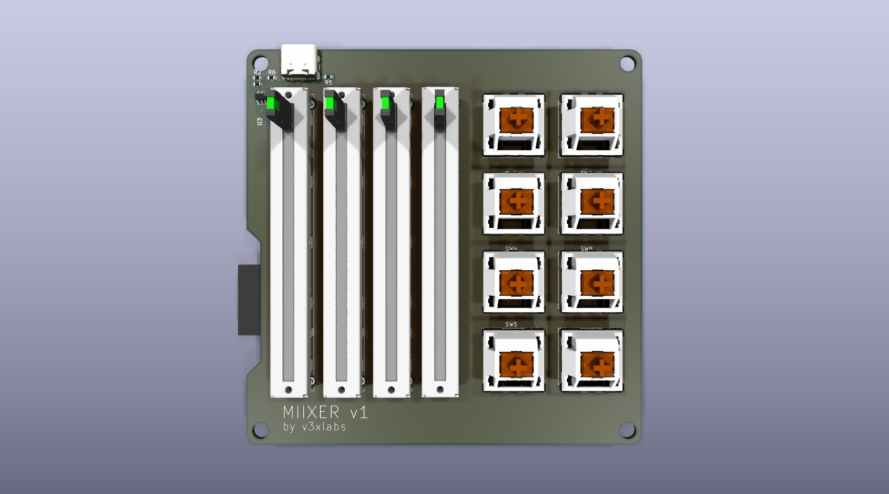
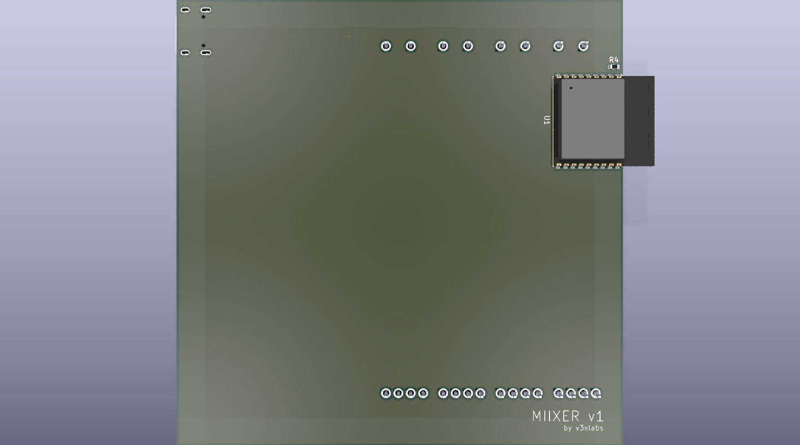

# SIIREN

An open-hardware digital notifier with ePaper display, esp32-s3, and removable battery.

> [!NOTE]
> This is a work in progress.

## Technical Specs

- **Processor**: esp32-s3
- **Inputs**
  - 5-btn slim d-pad
- **Outputs**:
  - ePaper display (specifics undecided)
- **Connectivity**:
  - USB-C (Power, Data & Flash)
  - Wifi & BLE

## Photos

See the [docs](docs) folder for the rendered schematics, PCBs, and 3D renders.

  
  

