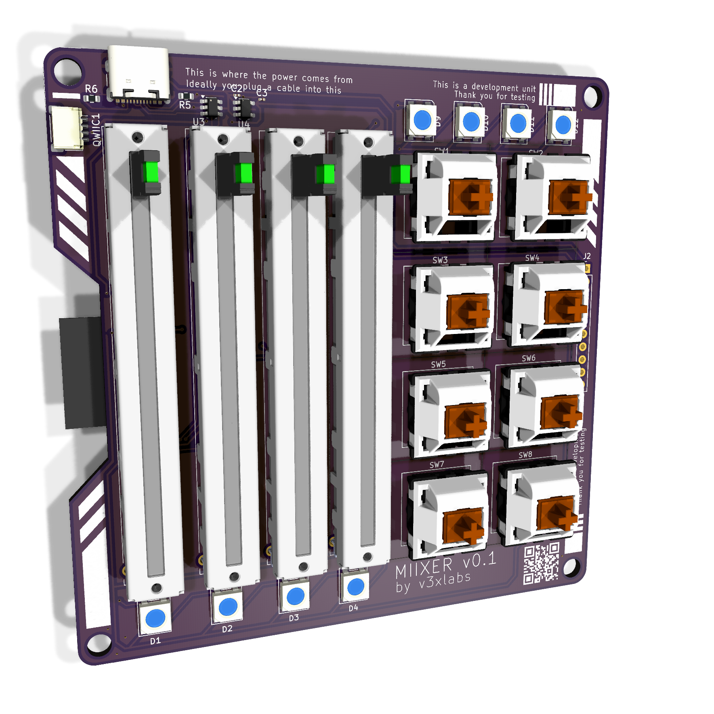

<p align="center">
  
</p>

# MIIXER

An open-hardware midi controller with esp32-s3, 4 linear faders, 8 keyswitches.

> [!NOTE]
> This is a work in progress.

## Technical Specs

- **Processor**: esp32-s3
- **Inputs**
  - 4 linear potentiometers 600mm
  - 8 Cherry MX Switches
- **ICs**
  - [PCF8574T](https://jlcpcb.com/api/file/downloadByFileSystemAccessId/8624297452529963008) - I2C IO Expander
  - [ADS1115IDGS](https://jlcpcb.com/api/file/downloadByFileSystemAccessId/8624297452529963008) - I2C ADC Expander
  - [AP2127K-3.3](https://www.diodes.com/assets/Datasheets/AP2127.pdf) - 5v to 3.3v LDO
  - [USBLC6-2SC6](https://www.st.com/resource/en/datasheet/usblc6-2.pdf) - ESD Protection
- **Connectivity**:
  - USB-C (Power, Data & Flash)
  - Wifi & BLE

## Photos

See the [docs](docs) folder for the rendered schematics, PCBs, and 3D renders.

<p align="center">
  
  
</p>

## ESPHome Compatability

Due to the fact that this devices uses common off-the-shelf I2C ICs and is esp32-c3 based, you can easily use it with ESPHome.

```yaml
# TODO: This yaml file is work in progress, its ment to give an impression, its has not been confirmed functional.
i2c:
  sda: GPIO8
  scl: GPIO9
  scan: true

# 4x Fader Input
ads1115:
  address: 0x48 # todo confirm
  update_interval: 5s
  # todo interrupt pin (io6)

# 4x Fader LEDs
tcl59208f:
  id: led_drv # optional
  address: # todo

# 8x Keyswitch Input
pcf8574:
  id: expander # optional
  address: 0x20 # todo confirm
  # todo interrupt pin (io7)

binary_sensor:
  # 8x Keyswitch Input
  - platform: pcf8574
    pin: P0
    name: "Switch 1"
    # todo add 7 more pins

sensor:
  # 4x Fader Analog Input
  - platform: ads1115
    multiplexer: 'A0_GND' # todo
    gain: 6.144 # todo
    # todo 3 more pins

output:
  # 4x Fader LEDs
  - platform: tcl59208f
    driver: led_drv # optional
    id: led1
    channel: 0
  - platform: tcl59208f
    driver: led_drv # optional
    id: led2
    channel: 1
  - platform: tcl59208f
    driver: led_drv # optional
    id: led3
    channel: 2
  - platform: tcl59208f
    driver: led_drv # optional
    id: led4
    channel: 3

light:
  # 4x Fader SK6812
  - platform: fastled_clockless
    chipset: SK6812
    pin: GPIO3
    num_leds: 4
    rgb_order: GRB
    name: "SK6812 Array"
```
