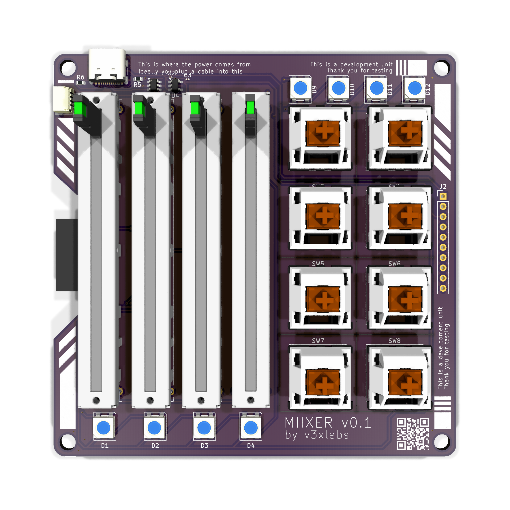
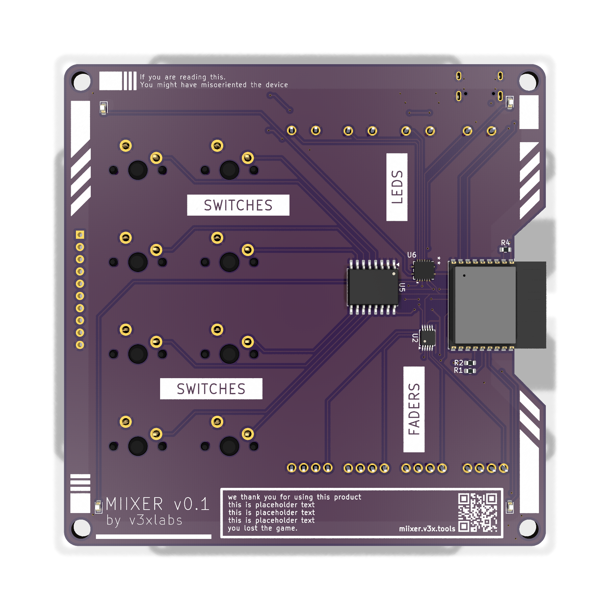

# MIIXER

An open-hardware midi controller with esp32-s3, 4 linear faders, 8 keyswitches.

> [!NOTE]
> This is a work in progress.

  

## Technical Specs

- **Processor**: esp32-s3
- **Inputs**
  - 4 linear potentiometers 600mm
  - 8 Cherry MX Switches
- **Connectivity**:
  - USB-C (Power, Data & Flash)
  - Wifi & BLE

## Photos

See the [docs](docs) folder for the rendered schematics, PCBs, and 3D renders.

  
  

